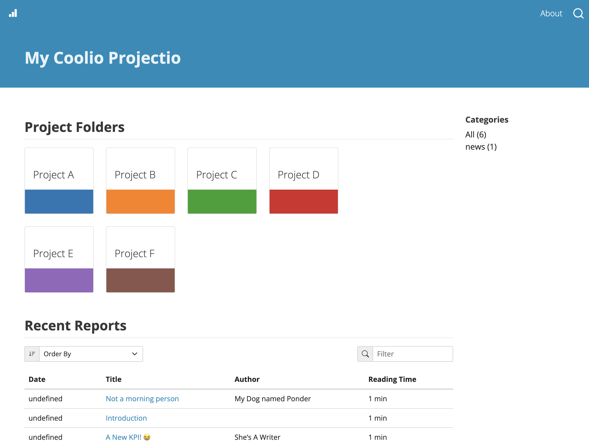
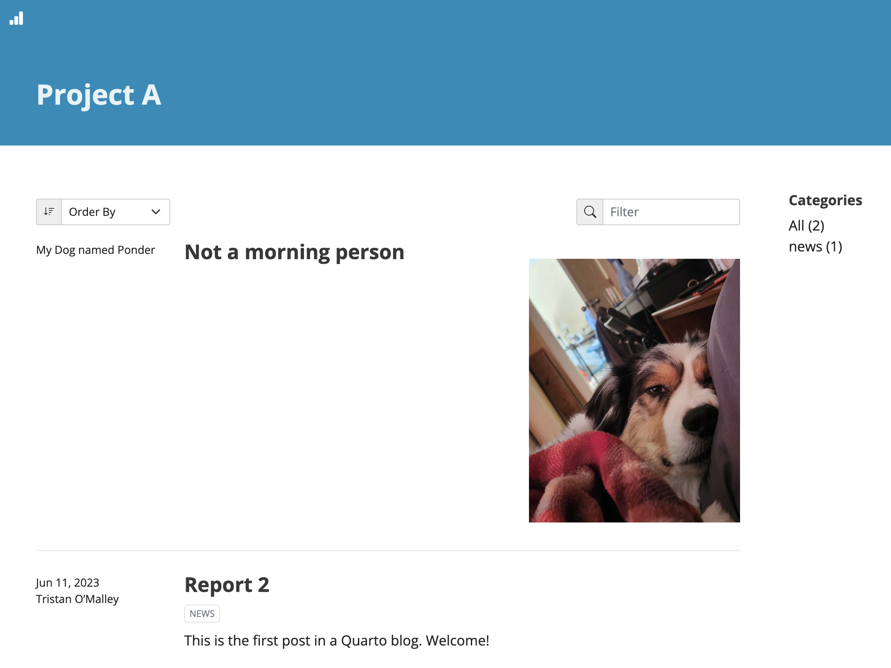

# Quarto-Django

This project generates starter code that uses [Quarto](https://quarto.org/) for authoring webpages with a [Django](https://www.djangoproject.com/) backend.

The goal of this project was to bridge the gap between the _very_ useful tooling provided by quarto and the way data folks actually want to use the tool (for website building specifically). 

### Motivation
Quarto provides tooling for converting common data analysis files into webpage reports, and fits it all into an easy to use blog-style project. BUT, quarto produces _static_ websites. In my case, [and a few others](https://github.com/quarto-dev/quarto-cli/discussions/6629), I wanted to use quarto so I could easily take an analysis run in jupyter and share it with stakeholders (via a link) without the time sucking process of moving every piece of content from a jupyter notebook into a google doc/slide-deck. For this to work, however, I needed the ability to limit who can see data analyses I publish. Preferably through social authentication like google-auth. This requires a backend.

## How to use it
1. Clone this repository
2. Navigate into the root of this project and run the following command:
```python
python start_project.py
```
3. Answer the provided prompts (See [features](#features) for a breakdown of prompt options)
4. Once the project is created, navigate into the project directory
5. Run the following command:
```bash
bash bin/build -s
```
6. You will be prompted to enter an email address and password what will be given `superuser` permissions for your project
7. A webserver will spin up. Navigate to `http://localhost:8000/` in your webbrowser, you should see the following:
<center></img></center>

## Directory Structure
The primary place you should spend your time is in the `projects/` directory.
```
root_directory
      |
      projects
         |
         project_a
            |
            report_1
                |
                index.qmd
                index_files
                    |
                    sleepy_ponder_jpeg
         project_f
            |
            modeling
                index.ipynb
```
- Whatever parent folders are places within the projects directory will appear on the homepage as colored tiles visualized above. 
- Whatever `index.qmd` or `index.ipynb` files placed within project subdirectories will be visualized as a table at the bottom of the homepage and will appear in the landing page for each parent project folder. So if you click on the `Project A` tile of the homepage, you will see the following webpage listing all the available reports within that project:
<center></img></center>
- To add a new project, a python script is added to `bin/` within the project root
    - `python bin/new_project.py`

## CLI Tools
1. `bash bin/build` 
    - This command is best used for initial setup of the project
    - Run initial database migrations
    - if `-c` if provided, you will be prompted to create a superuser
    - Activates `quarto render`
    - Launches the Django Webserver
2. `bash bin/run`
    - Activates `quarto render`
    - Launches the Django Webserver
    - This command is probably the best choice when developing your reports. 
3. `python bin/new_project.py`
    - Generates a new project directory within `projects/`
    - Adds a required `index.qmd` file to the newly created directory
4. `python django_site/manage.py`
    - All of the standard django tooling is available here
5. TODO: Add a command that renders a single analysis. Currently `bash bin/run` renders the webpage for every analysis.

## Features

### Group Permissioning

- Group permissioning is set in the admin portal `http://localhost:8000/admin`
- Group permissioning is set at the `User Group, Project` level

#### Setting Up Group Permissions:

- Navigate to `http://localhost:8000/admin` and log in
- Add a user group
- Add a project group permission and link it to the desired group and the desired project
- Add users to the group

Once this is done, if a user clicks on a project that requires a group permission they do not have, then that user will be redirected back to the homepage

### Google Auth

- If you enable google auth during initial setup, you will need to generate an `OAUTH KEY` and an `OAUTH SECRET KEY`. 
    - See the following docs for instructions: https://developers.google.com/identity/protocols/oauth2
- Those two keys are have to be set within `django_site/django_site/settings.py`. If you skipped providing the keys, look for the following in your `settings.py` file:
```python
SOCIAL_AUTH_GOOGLE_OAUTH2_KEY = ''
SOCIAL_AUTH_GOOGLE_OAUTH2_SECRET = ''
```

### Share Links

- Share links are buttons that appear at the top of reports. The button generates an encrypted url that allows users without user permissions to view the webpage
- Currently share links do not expire, though this can be easily implemented. 
- Share links can be revoked in the admin portal by deleting the record for a specific share link. 
- This is a feature inspired by the way google doc share links function, and the goal is to lower the burden of managing user permissioning within an organization. 

### Development

**Where are the important files? What do they do?**
- The `scripts/` directory is where most of this projects contributions exist. 
    - The homepage is set via the `pre_render/generate_project_menus.py` and the `templates/index_template.html` file
    - Once quarto has rendered the files within `projects/` the `scripts/set_django_html.py` loops over all of the html elements and updates filepaths and sets django specific templating to ensure static files are rendered
    - The `scripts/copy_to_django.py` file moves all of the files within `_site` into their location within `django_site`
    - The `scripts/update_department_model.py` file loops over the top level directories within `projects/` and adds any newly added projects to the django database
